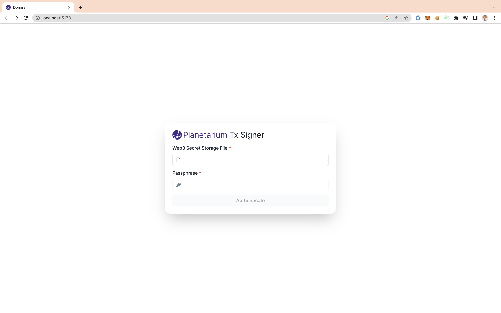
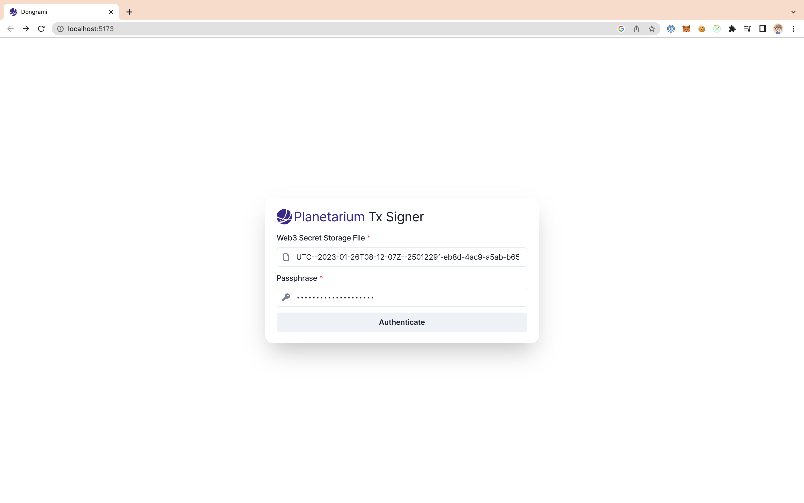
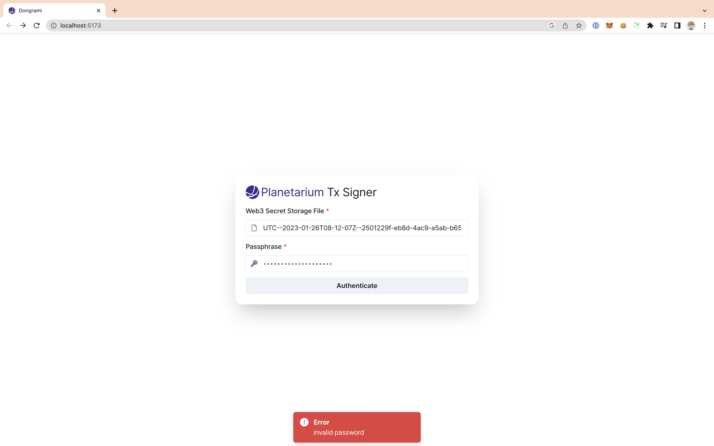
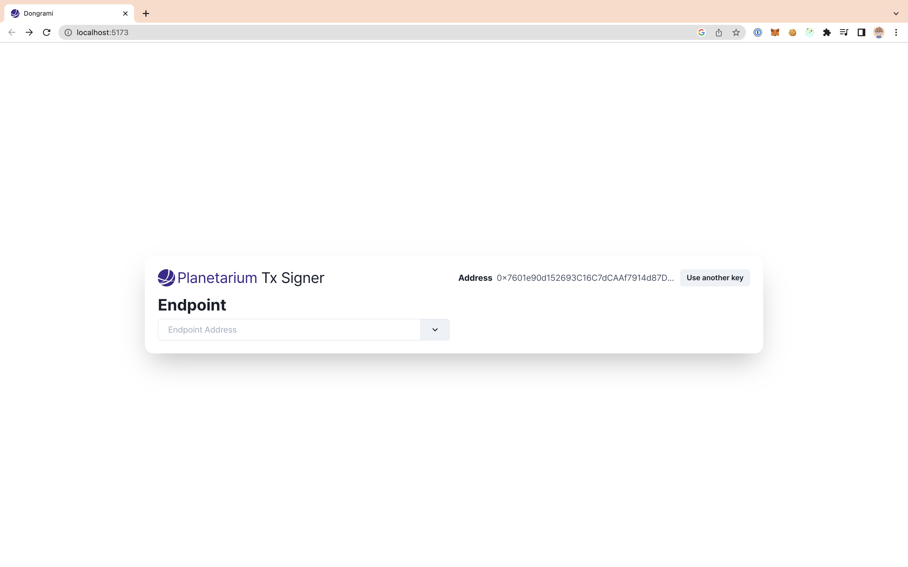
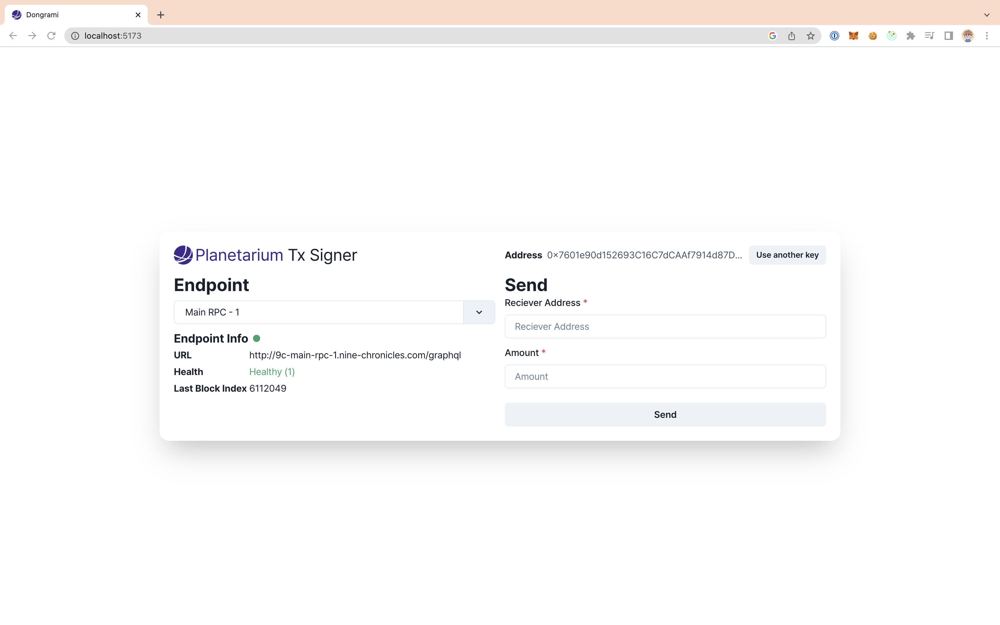
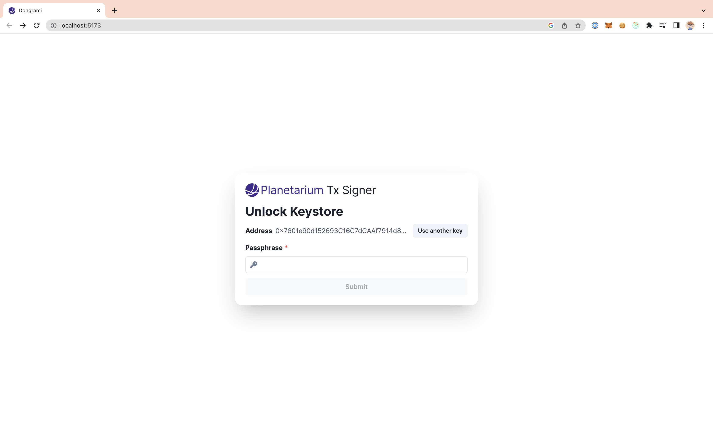

# Dongrami

Dongrami is a web application that allows you to sign transactions with your keystore, formatted as [Web3 Secret Storage](https://ethereum.org/en/developers/docs/data-structures-and-encoding/web3-secret-storage/)

> **Warning**  
> This application is still in development, and is not ready for production use. Use at your own risk.

## How to run

### Run in development mode

```shell
yarn install
yarn dev
```

### Run in production mode

```shell
yarn install
yarn build
yarn preview
```

### Run in docker

```shell
docker build -t dongrami .
docker run -p 3000:4173 dongrami
```

## How to use

Visit Application URL with your browser.

> **Application URL**  
> Development mode: http://localhost:5173  
> Production mode: http://localhost:4173  
> Docker: http://localhost:(Port you set)

#### Authenticate Page



This is the authenticate page.

Click the input box with the placeholder "Select a keyfile..." to select a keystore file.


Select a keystore file to load. The keystore file must be formatted as [Web3 Secret Storage](https://ethereum.org/en/developers/docs/data-structures-and-encoding/web3-secret-storage/).



Enter the passphrase of the keystore file.



If the passphrase is incorrect, the error message will be displayed.

#### Main Page



This is the main page. To sign a transaction, select an endpoint first.



Now you can sign a transaction.

#### Unlock Page



> **Note**  
> Private key is stored in **browser-inaccessible memory**.
> Passphrase is temporary stored only for unlocking the private key. After unlocking, passphrase is erased.

Because of the security management policy, the browser is unable to access to the private key when the application is reloaded. (e.g. refreshed). To access the private key, you need to unlock the private key with passphrase again.
